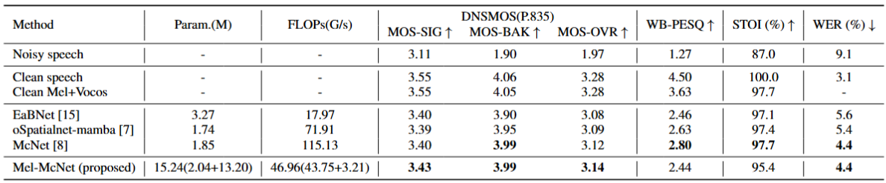

# Mel-McNet
[](https://arxiv.org/abs/2505.19576)

The official repo: **Mel-McNet: A Mel-Scale Framework for Online Multichannel Speech Enhancement** accepted by Interspeech 2025.

Code and the pretrained model will be updated soon.

## Introduction
This work proposes a Mel-scale framework for online multichannel speech enhancement, termed Mel-McNet. It proposes spectral and spatial information with two key components: an effective STFT-to-Mel module compressing multichannel STFT features into Mel-frequency representations, and a modified McNet backbone directly operating in the Mel domain to generate enhanced LogMel spectra. The spectra can be directly fed to vocoders for waveform reconstruction or ASR systems for transcription. Experiments on CHiME-3 show that Mel-McNet can reduce computational complexity by 60% while maintaining comparable enhancement and ASR performance to the original McNet. Mel-McNet also outperforms other SOTA methods, verifying the potential of Mel-scale speech enhancement.

<div align="center">
      
</div>

## Performance
**Online multichannel speech enhancement results on 6-channel simulated CHiME-3 dataset.**



Note: 

1) For Mel-McNet, the Param. and FLOPs of speech enhancement network/neural vocoder are given in addition;

2) The overall real-time factor (RTF) of the proposed framework is approximately 0.799, with Mel-McNet and Vocos contributing 0.755 and 0.044, respectively. (Evaluated on a platform equipped with an Intel(R) Core(TM) i7-9700 CPU @ 3.00GHz.

## Citation
If you find our work helpful, please cite
```
@misc{yang2025melmcnetmelscaleframeworkonline,
      title={Mel-McNet: A Mel-Scale Framework for Online Multichannel Speech Enhancement}, 
      author={Yujie Yang and Bing Yang and Xiaofei Li},
      year={2025},
      eprint={2505.19576},
      archivePrefix={arXiv},
      primaryClass={eess.AS},
      url={https://arxiv.org/abs/2505.19576}, 
}
```
